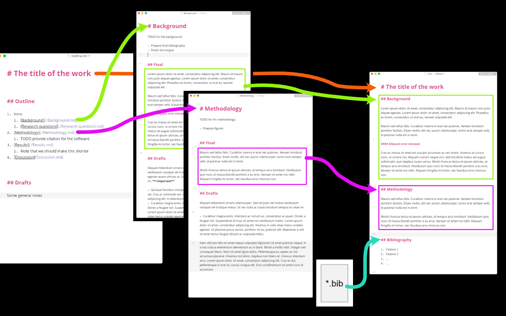

# markdown2paper

Takes outline, multiple markdown files and \*.bib file and makes a final-final-really-final markdown file with bibiography included.

### :fire::fire::fire: Features

1. Merges multiple markdown documents into one final version
2. Uses single `Outline` section of the root document to lay out the final paper
3. Includes child documents using links in the Outline file
4. Formats bibliography using `*.bib` file and pandoc `@key` marks



## Installation

```bash
go get github.com/Jblew/markdown2paper/markdown2paper
```

Then if you have $GOPATH added to $PATH, the cli should be available.

## Usage

1. Create a config file in the paper root directory:

```yaml
bibPath: bibliography.bib
outlinePath: README.md
outPath: final-final-really-final-v3.md
```

2. Run build command

```bash
$ markdown2paper build
```

3. Paper is assembled
